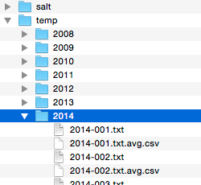
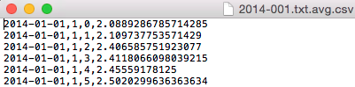
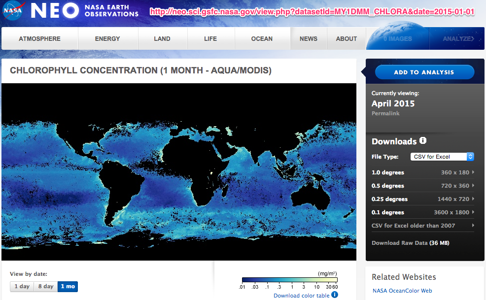
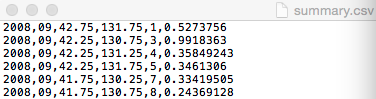

# HYCOM data 정제

아래 사이트에서 파일 다운로드할 수 있음. 한국 지역만 다운로드 해야 하므로 파라미터를 주어야 함.


웹사이트의 path구조, 연도, 날짜, 데이터종류 별로 다운로드 해야 함 -> 다운로드 프로그램 작성

```
val exports = Array(("expt_90.6", 2008, 104), ("expt_90.6", 2009, 125),
    ("expt_90.8", 2009, 238), ("expt_90.8", 2010, 364), ("expt_90.8", 2011, 1),
    ("expt_90.9", 2011, 362), ("expt_90.9", 2012, 365), ("expt_90.9", 2013, 231),
    ("expt_91.0", 2013, 132), ("expt_91.0", 2014, 93), ("expt_91.1", 2014, 270) )

val kindMap = Map("temp" -> "temp.ascii?temperature", "salt" -> "salt.ascii?salinity", "uvel" -> "uvel.ascii?u", "vvel" -> "vvel.ascii?v")

val url = f"http://tds.hycom.org/thredds/dodsC/GLBa0.08/${exptName}/${year}/${kindPath}[${mt}:1:${mt}][0:1:6][1819:1:2155][559:1:824]"
```

다운로드 한 파일을 날짜, 해구번호, 깊이, 평균값 CSV 파일로 변환




# 오징어 어획량과 수온 시각화

어획량 데이터 + HYCOM 수온데이터 + NCL 코드 => 시각화 결과 이미지

# 클로로필 자료 생성

파일 다운로드 



데이터를 연,월,해구별(위,경도,해구번호),값 형태의 CSV, Json 형태로 변환



이후 Google Map에 어획량/클로로필 데이터 표출
